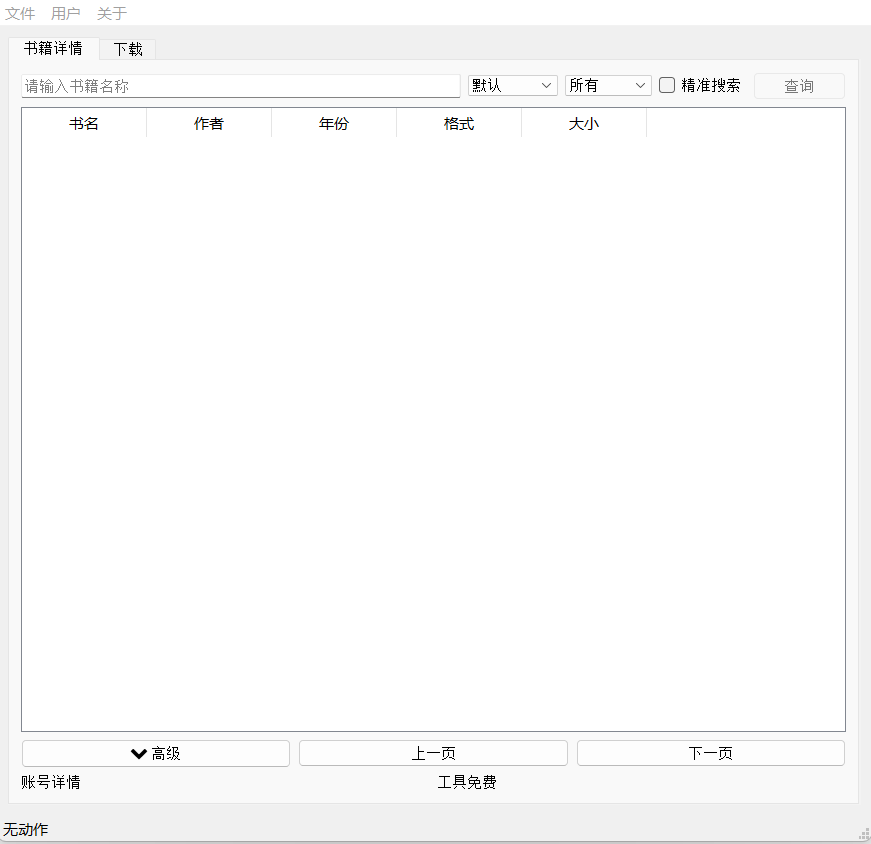

 开源图书(O-LIB)
 
O-LIB is a free and open source software for PC.

 

找到我

[Bilibili](https://space.bilibili.com/19276680) 
[公众号](https://space.bilibili.com/19276680)

功能简介

1.软件开源，持续优化，无广告。
2.便捷搜索
3.自定义文件存储位置

# Interface-界面 

